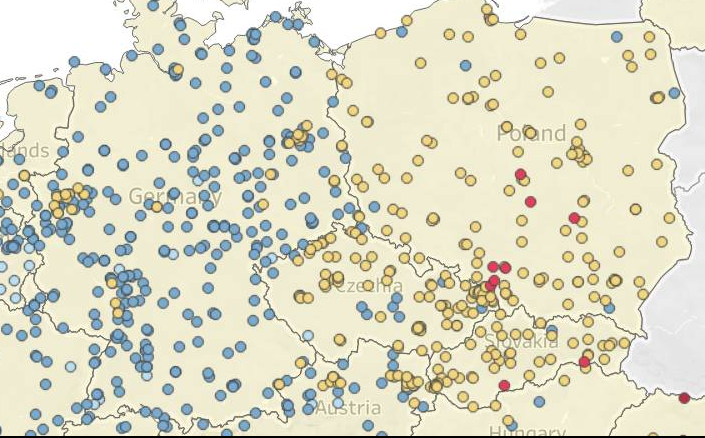

## Air Quality Measurements in Germany and Poland

1) Do research and find data about a sensor network. Make sure to show it on a map. Feel free to use any tools for better visualization effects, such as Power BI, etc.

In Poland and Germany, there are several air quality monitoring networks that consist of various sensors measuring pollutants such as PM2.5, PM10, NO2, O3, and CO. These sensors are strategically placed in diffrent locations, including urban areas, industrial zones, and rural regions, to provide comprehensive air quality data. But is it done exactly the same in both countries? Are there any differences in the way the networks are structured or how the data is collected and processed?

We focused on mapping the sensor networks in both countries to understand their distribution and coverage. The map below illustrates the locations of air quality sensors across Germany and Poland, highlighting areas with higher concentrations of monitoring stations.

2) How are new sensors discovered? Is it self-discovery or centralized discovery? Can DFS or BFS be applied? 

3) Model the sensor network (undirected graph, directed graph, or maybe a spanning tree?). If data is not available, make assumptions!
Perform a basic analysis of the network.
Is it a bipartite graph? Is the network dense or sparse? What is the number of vertices and edges? Is it connected? Does it contain cycles? etc.

4) Analyze whether there are any weak points.
What happens when communication links fail? Is there any “weak” point? Can we propose a solution? How many such “weak” points are there? Should we analyze whether the network is planar and reference Kuratowski’s theorem.? How will it help?

5) Do sensors need maintenance or calibration from time to time? What is the most efficient way? Do we need to determine whether selected network instances contain Euler cycles or Hamiltonian cycles to visit each sensor exactly once? How can this information be applied? TSP?

6) Do sensors communicate with each other? When communicating, can Dijkstra’s algorithm help somehow? Should we add new links?

DIFFRENT MEASURMENT METHODS:

| Rank | Method                | Scientific / regulatory quality   | Main strengths                                                 | Main limitations                              |
| ---- | --------------------- | --------------------------------- | -------------------------------------------------------------- | --------------------------------------------- |
| 1    | **TEOM-FDMS**         | Excellent                         | Near-reference continuous monitoring; corrects volatile losses | Expensive, complex                            |
| 2    | **BETA / BAM**        | Excellent                         | Widely accepted regulatory equivalent method                   | Filter artifacts possible                     |
| 3    | **TEOM**              | Very high                         | Stable continuous mass measurements                            | Heated inlet may lose volatile aerosols       |
| 4    | **nephelometry+beta** | High                              | Combines optical speed with beta calibration                   | Calibration-dependent                         |
| 5    | **SMPS**              | Very advanced research instrument | Extremely detailed particle-size characterization              | Not designed primarily for regulatory PM mass |
| 6    | **nephelometry**      | Moderate–high                     | Good real-time aerosol scattering measurements                 | PM mass inferred indirectly                   |
| 7    | **light-scat**        | Moderate                          | Cheap, fast, dense networks possible                           | Sensitive to humidity/composition             |
| 8    | **OPC-CMC**           | Moderate–low                      | Useful low-cost monitoring                                     | Lower accuracy; calibration drift             |
| 9    | **other**             | Unknown                           | Depends on instrument                                          | Cannot evaluate                               |
